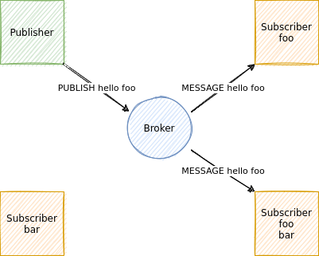

# Dallal

> Dallal means broker in Persian.

## Introduction

A Message Broker is a server that distributes messages received from clients among them. The two main operations are **Publish** and **Subscribe**. In a Subscribe operation, a client requests to listen to a specific topic. In a Publish operation, a client publishes a message on a specific topic. The broker then delivers the messages to **all** subscribers listening on that topic.



## Part 1: TCP Implementation

All communication between server and client is implemented using TCP.

### Commands

**Client to Server:**

- **Publish**: Sends a message from the client under a specific topic to the server. Messages are ASCII strings of arbitrary length.
- **Subscribe**: Notifies the server that this client wants to receive messages for the given topic.
- **Ping**: Sent from the client to verify the connection is alive.
- **Pong**: Sent from the client in response to a Ping message.

**Server to Client:**

- **Message**: Sends a message from the server to a client that has subscribed to a topic (includes both the message and the topic). Messages are ASCII strings of arbitrary length.
- **SubAck**: Sent from the server to acknowledge a successful Subscribe operation.
- **PubAck**: Sent from the server to acknowledge a successful Publish operation.
- **Ping**: Sent from the server to verify the connection is alive.
- **Pong**: Sent from the server in response to a Ping message.

### Server Implementation

The server has a socket that listens on a specific port (default: 1373). Since the server needs to handle multiple simultaneous connections, you'll need to create a Thread for each connection so that the `accept` function can be called immediately. The server keeps all connections open and doesn't close any. For the server, each connection represents a client, so it must maintain a list of sockets and their subscribed topics.

```python
import socket
import threading

HOST = '127.0.0.1'  # Standard loopback interface address (localhost)
PORT = 1373         # Port to listen on (non-privileged ports are > 1023)

def handler(conn, addr):
    with conn:
        print('Connected by', addr)
        while True:
            data = conn.recv(1024)
            if not data:
                break
            conn.sendall(data)
        print('Disconnected by', addr)

with socket.socket(socket.AF_INET, socket.SOCK_STREAM) as s:
    s.bind((HOST, PORT))
    s.listen()
    while True:
        conn, addr = s.accept()
        threading.Thread(target=handler, args=(conn, addr)).start()
```

Note: The server must track the state of connections and avoid sending data on closed connections.

### Client Implementation

The client is implemented as a command-line tool (no GUI required).

**Publish Command:**

```bash
python3 client.py <host> <port> publish <topic> <message>

# Success:
your message published successfully

# Failure:
your message publishing failed
```

The client waits up to **10 seconds** for a PubAck from the server. If received, it notifies the user of success; otherwise, an appropriate error is displayed.

**Subscribe Command:**

```bash
python3 client.py <host> <port> subscribe <topic-1> <topic-2> ... <topic-n>

# Success:
subscribing on <topic-1> <topic-2> ... <topic-n>
<topic-1>: message
<topic-2>: message
<topic-1>: message

# Failure:
subscribing failed
```

This command can be called with one or more topics. You'll need to use Threads to maintain multiple connections with the server. For each topic, you need to send a Subscribe message and receive a SubAck within **10 seconds**. If SubAck is not received in time, the program should terminate with an appropriate message. The program then listens on all created sockets to display incoming messages.

### Bonus Features

1. The client should respond to Ping messages from the server with Pong in both modes.
2. The server should send Ping messages to clients every **10 seconds**. If no response is received before the next period, print the client's IP address and port.
3. If a client doesn't respond to Ping for three consecutive periods, close the connection and remove the client from the list.
4. Messages received from Publishers should be queued in the Broker until successfully delivered to Subscribers (confirmed by Ack). If a new message arrives for the same topic before the previous one is delivered, replace the old message with the new one.

## Part 2: UDP Implementation and Flow Control

### TCP Flow Control Analysis

1. Run a client in subscriber mode for the topic `flow-control-tcp`.
2. Run another client in publish mode and periodically publish messages to `flow-control-tcp` in a loop.
3. Use **Wireshark** to analyze and interpret the network packets.

### Maximum Concurrent TCP Connections

Run the message broker and start multiple subscriber clients (preferably in a loop). What is the upper limit on the number of concurrent clients? Is this number comparable to the maximum number of available TCP ports? What causes this limitation?

### UDP Message Broker Implementation

The broker should support UDP connections alongside TCP.

The main difference with UDP is the lack of a persistent connection between server and client. The server listens on UDP port **1234** for packets from any client and processes the source using UDP packet headers.

```python
import socket

client = socket.socket(socket.AF_INET, socket.SOCK_DGRAM)  # UDP
client.bind(('', 1234))
while True:
    data, addr = client.recvfrom(1024)
    print("received message:", data, addr)
```

### Health Checking with UDP

Since UDP has no built-in mechanism for detecting connection status, you need to implement this at the application layer:

- **Client**: Send a Ping packet to the server every 10 seconds. A healthy connection means receiving a Pong after sending a Ping.
- **Server**: After receiving a message from a new address, monitor Ping messages from that client. Receiving a Ping means the connection is active for another 10 seconds. The server should respond with Pong.

### Storing Client Information

UDP clients only need the broker's address and port to communicate. However, the server must track the last port and IP used by each client to send messages back to them.

```python
import socket

client = socket.socket(socket.AF_INET, socket.SOCK_DGRAM)  # UDP
while True:
    data, addr = client.recvfrom(1024)
    print("received message:", data, addr)
```

The UDP socket will bind to a random available port (e.g., 37020) and use it for both sending and receiving packets.

### Flow Control Comparison: TCP vs UDP

Using a UDP subscriber client that subscribes to a topic but **doesn't read** any packets after subscribing, and a publisher that continuously publishes to the same topic, use **Wireshark** to explain what happens to the packets. Are they lost?

## Deliverables

1. Protocol design document explaining how commands are transmitted over TCP/UDP connections
2. Server implementation in your preferred programming language
3. Client implementation in your preferred programming language

## Notes

- This is an **individual** assignment.
- The implementation should not have any unhandled exceptions. All errors should be properly handled or at least documented with comments explaining why they occur.
- Any plagiarism or cheating will result in a zero grade for all parties involved.
- Python socket programming examples are provided, but you're free to choose any programming language.
